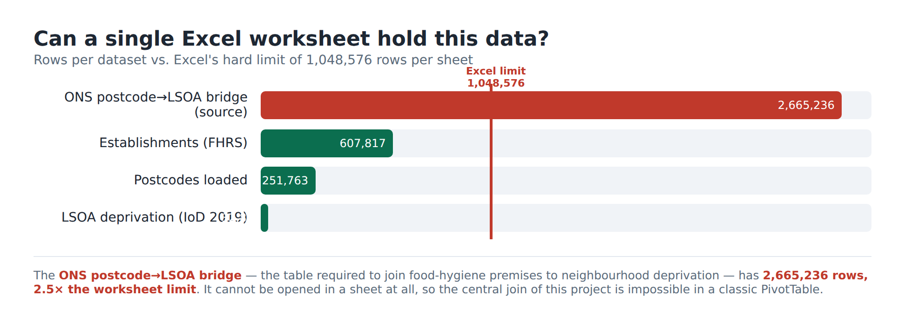

# Why this can't be done with an Excel PivotTable



**Short answer:** the simple, single-dataset breakdowns *can* be done in Excel.
Everything that makes this project actually answer its question — joining food
hygiene to deprivation, at neighbourhood level, on cleaned data — hits walls a
PivotTable cannot cross. A PivotTable summarises **one flat table**; this analysis
is **nine related tables, one of which is 2.5× too big to open**.

Be fair about it: Excel *can* produce "average rating by region" or "by business
type" from the 608k-row extract — those are single-table group-bys, exactly what a
pivot is for. The argument below is about the parts that genuinely break.

---

## Wall 1 — Volume: the join table won't fit in a sheet

An Excel worksheet holds **1,048,576 rows**. To attach neighbourhood deprivation
to each premise you must join through the ONS postcode→LSOA lookup, which is
**2,665,236 rows — 2.5× the limit**. You cannot even *open* the file in a sheet,
let alone `VLOOKUP` into it. The single most important table in the project is
off-limits before any analysis begins.

> *"Use Power Query / Power Pivot then."* You can — but at that point you've left
> the PivotTable behind and are running a relational data model and a query
> language (DAX/M) bolted into Excel. That's re-implementing the database, not
> using a pivot table — and it still hits Walls 3–5 below.

## Wall 2 — Relationships: a pivot flattens ONE table; this is nine

The model is `region → local_authority → establishment ← business_type`, with
`establishment → postcode → imd_lsoa` and `local_authority → imd_lad`, plus
`rating_type` and the cleaning audit tables. The headline finding needs a
**two-hop join** for every one of 600k rows:

```sql
establishment → postcode (premise's postcode) → imd_lsoa (that postcode's neighbourhood IMD)
```

A PivotTable has no concept of a join. To fake it you would denormalise the whole
thing into one mega-sheet with stacked `XLOOKUP` columns — except the postcode
bridge (Wall 1) is too big to be the lookup target, and 600k live lookups
recalculate on every edit.

## Wall 3 — The keys don't match: joins need cleaning, not lookups

The datasets don't share a key, so the joins required real logic:

* **FHRS authority *names* → ONS *codes*.** Matching needed normalisation
  (lower-case, strip "City of"/"Borough of", `&`→`and`, de-hyphenate) **plus** an
  alias table (`Bristol → "Bristol, City of"`) **plus** handling 2019–2023
  boundary changes (Somerset, North Yorkshire… have no single old district).
  `XLOOKUP` needs an *exact* key; every near-miss silently returns `#N/A` and the
  row vanishes from the totals without warning.
* **Postcodes are formatted differently** in FHRS vs ONS, so both sides had to be
  normalised (`UPPER`, strip spaces) before they would join.
* **Vintage matters:** IoD 2019 uses 2011 LSOAs, so the postcode lookup had to be
  the 2011-LSOA edition. A pivot gives you no place to encode "use this vintage
  because the other dataset is 2011-based."

## Wall 4 — The maths isn't pivot maths

A PivotTable does sums, counts and averages over groups. The findings needed:

* **Pearson correlation** between hygiene and **each of 8 deprivation domains** —
  not a pivot aggregation; you'd build a 600k-row helper area and `CORREL()`, per
  domain.
* **Deprivation quintiles / deciles** (`NTILE`) — needs `RANK`/`PERCENTILE` helper
  columns, recomputed on every change.
* **Premises per 1,000 residents** — this is a *ratio across two different grains*:
  count premises per LSOA, then divide by that LSOA's population, then aggregate
  by decile. A pivot's single aggregation step can't "group at grain A, then take
  a ratio against grain B" without double-counting population.

## Wall 5 — Process: cleaning, audit and refresh

* **Cleaning with an audit trail.** We quarantined 1,165 impossible-date rows into
  a `establishment_rejects` table *with reasons*, kept a `cleaning_log`, and left
  it reversible. In Excel, "cleaning" is deleting rows by hand — no record of what
  went or why, and no way to undo it next month.
* **Reproducibility.** The whole pipeline is scripted from documented open-data
  URLs; a student re-runs four commands and gets the same database. A pivot
  workbook is a hand-built artifact that someone has to rebuild by memory.
* **Refresh.** FHRS republishes monthly. The scripts re-run; a workbook of stacked
  lookups and helper columns has to be re-pointed and re-checked by hand.

---

## Summary

| Task | Plain PivotTable | This project |
|---|---|---|
| Avg rating by region / business type | ✅ yes | trivial |
| Hold the postcode→LSOA bridge (2.66M rows) | ❌ exceeds sheet limit | one indexed table |
| Join premises → postcode → neighbourhood IMD | ❌ no joins | 2-line SQL |
| Fuzzy name→code matching, boundary changes | ❌ exact-match only, silent `#N/A` | normalise + alias in load |
| Pearson r across 8 domains, NTILE deciles | ❌ helper-column gymnastics | built-in SQL |
| Premises per 1,000 (ratio across grains) | ❌ double-counts | one query |
| Cleaning with reversible audit trail | ❌ manual deletes | quarantine + log |
| Reproducible monthly refresh | ❌ rebuild by hand | re-run scripts |

The honest line for a presentation: **"Excel answers the easy half of question 1.
The relational database is what makes the deprivation question answerable at all —
because the join table alone is 2.5× larger than Excel can open, and the join,
the correlation and the cleaning all need a query engine, not a pivot."**

*(All row counts above are live from the loaded database / source files; see the
figure and `report/analysis-geo-results.txt`.)*
