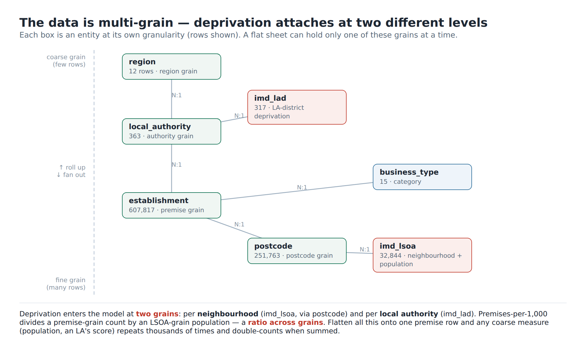

# Is the relationship complex enough to warrant SQL?

*Ground rule for this argument: assume Excel can hold a **trillion** rows and runs
on a **supercomputer**. Volume and speed are off the table. The only question is
whether the **structure of the relationships** justifies a relational database
rather than a flat sheet + PivotTable.*

**Answer: yes — and the reason has nothing to do with size.** This data is
**multi-entity and multi-grain**: several things are measured at *different levels
of detail*, and deprivation attaches at *two* of them. A PivotTable works on **one
table at one grain**. The moment you must combine entities at different grains, a
single flat sheet can no longer represent the data without either losing a
question or computing the wrong number — no matter how many rows it can hold.



---

## A size-independent test for "does this need SQL?"

> A PivotTable is enough when the data is **one table at one grain** with
> categorical columns to slice by.
> You need relational joins when you have **multiple entities at different
> granularities that must be combined** — because then (1) there is no single way
> to flatten them that serves every question, (2) coarser measures **double-count**
> if you do flatten, and (3) every parent fact gets **duplicated**, so the sheet
> can hold mutually contradictory values.

This project fails all three parts of the "one table, one grain" condition. Here
is why, with this dataset's actual structure.

## 1. There are five different grains, not one

| Entity | Grain | Rows |
|---|---|--:|
| `region` | region | 12 |
| `imd_lad` | local-authority district (deprivation) | 317 |
| `local_authority` | food authority | 363 |
| `imd_lsoa` | **neighbourhood** (~1,500 people) + population | 32,844 |
| `postcode` | postcode | 251,763 |
| `establishment` | **premise** | 607,817 |

A flat sheet has to pick **one** grain for its rows (here, the premise). Every
other entity's attributes then get **repeated down the premise rows**. That
repetition is the source of every problem below — and it is a *logical* problem,
not a storage one, so a trillion-row supercomputer doesn't fix it.

## 2. Deprivation attaches at TWO grains — the join graph branches

It isn't a single lookup chain. From the premise you fan out along independent
branches that rejoin deprivation at *different* levels:

```
establishment ─→ local_authority ─→ region
              └─→ local_authority ─→ imd_lad        (deprivation at LA grain)
              └─→ business_type
              └─→ postcode ─→ imd_lsoa              (deprivation at NEIGHBOURHOOD grain)
```

So "deprivation" is two different columns at two different resolutions. A pivot has
exactly two axes (rows, columns) and one underlying table; it cannot hold a star
of joins where the *same concept* enters at two grains. You'd have to build a
separate flattened sheet for each question — i.e. hand-maintain several
denormalised copies, which is the very thing a schema exists to avoid.

## 3. Flattening makes coarse measures double-count (a worked example)

Put everything on the premise row and ask the genuinely useful question
*"premises per 1,000 residents by deprivation decile"*:

* premises are counted at **premise** grain,
* population lives at **neighbourhood** grain.

On a flat sheet, each neighbourhood's population is copied onto **every premise in
it**. `SUM(population)` then counts a neighbourhood of 1,500 people once for each
of its (say) 40 premises = 60,000 — off by 40×. To get it right you must aggregate
premises **to the LSOA grain first**, then divide by that LSOA's single population,
then roll up to decile. That is two GROUP BYs at two grains in one query — exactly
what SQL expresses and a single pivot aggregation cannot. (The correct answer:
9.45 premises/1,000 in the most-deprived decile vs 4.36 in the least.)

## 4. The grain you join at changes the answer

Because the grains are real and distinct, the *same* correlation comes out
differently depending on which grain you compute it at:

| Grain of analysis | Deprivation↔hygiene Pearson r |
|---|--:|
| per **local authority** (n≈289) | **−0.38** |
| per **premise / neighbourhood** (n≈370k) | **−0.10** |

That gap is the *ecological correlation* effect — aggregating to areas averages
out individual noise. It is only **expressible** because the model keeps the grains
separate and lets you choose. A flat premise-grain sheet silently commits you to
one of them and hides that the choice even exists.

## 5. One source of truth vs thousands of copies (integrity, not size)

Flattening stores each local authority's deprivation score on **every one of its
premises** — Birmingham's score sits on ~12,000 rows. With infinite storage the
*space* is free, but the *integrity* is not: there is no longer a single place
that holds "Birmingham's IMD score". Edit or refresh one copy and the sheet now
contains two different truths for the same fact, with nothing to stop it. The
relational design stores that score **once** in `imd_lad` (we verified the schema
is BCNF), and the join reconstructs it on demand. Normalisation is a *correctness*
guarantee about update anomalies — a trillion-row machine makes it worse, not
better, because there are simply more duplicated copies to fall out of sync.

## 6. The relationships are derived, optional and fuzzy

These aren't clean shared keys you can `XLOOKUP`:

* **FHRS authority *names* → ONS *codes*** needed normalisation + an alias table +
  handling of post-2019 boundary changes. Nine English authorities legitimately
  have **no** deprivation district (unitary mergers / port health authorities).
* **Postcodes** are formatted differently on each side and had to be normalised
  before they would match; non-English postcodes resolve to an LSOA that has **no**
  English IMD row.

Representing "this authority has no deprivation match" is a natural **outer join**
in SQL (the value is `NULL`, and aggregates ignore it). On a flat sheet a failed
match is a blank cell that silently distorts any average computed over it.

---

## Being fair: where a PivotTable genuinely is enough

If the task were only *"average rating by region"* or *"by business type"*, a
pivot on the single 608k-row premise table is the right tool — those are
one-table, one-grain, categorical group-bys, and they'd work fine at a trillion
rows. The relational database earns its place specifically because the **deprivation
questions force you to combine entities at different grains**.

## Verdict

The relationship is complex enough to warrant SQL — not because the data is big,
but because it is **multi-grain with a branching join graph**. Under those
conditions a single flat table cannot simultaneously (a) answer all the questions,
(b) aggregate coarse measures without double-counting, and (c) keep one
authoritative copy of each fact. Those are structural properties of the
relationships, true at 600 thousand rows or 600 billion. Size was never the
reason; **shape** is.
